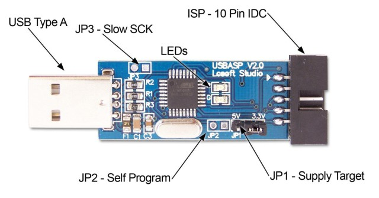
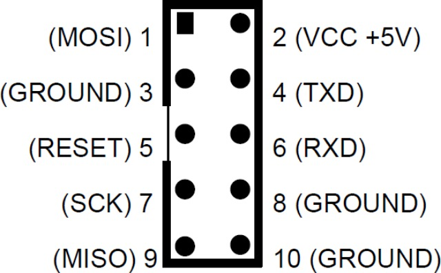

Homes-smarT
===========

Homes-smarT - some utils (author MaksMS) for simple experimental SmartHome project based on USBasp device.

License
=======

This sources is free software; you can redistribute it and/or modify it under the terms of
the GNU Lesser General Public License as published by the Free Software Foundation;
either version 2.1 of the License, or (at your option) any later version.

You should have received a copy of the GNU Lesser General Public License along with this
script; if not, please visit http://www.gnu.org/copyleft/gpl.html for more information.

Hardware
========

Software
========

* usbgpio =>
* usbtemp =>

Flashing direct
===============
	
	avrdude -c usbasp -p m8 -U flash:w:usbgpio_m8.hex -U hfuse:w:0xc9:m -U lfuse:w:0xef:m
	or
	avrdude -c usbasp -p m8 -U flash:w:usbtemp_m8.hex -U hfuse:w:0xc9:m -U lfuse:w:0xef:m

Flashing with bootloader
========================
	
	avrdude -c usbasp -p m8 -U flash:w:boot_m8.hex -U hfuse:w:0xc0:m -U lfuse:w:0x9f:m -U lock:w:0x2f:m
	
	and in flashed device
	avrdude -c usbasp -p m8 -U flash:w:usbgpio_m8.hex
	or
	avrdude -c usbasp -p m8 -U flash:w:usbtemp_m8.hex

Usage
=====
	
	usbtemp sensors
	usbtemp temp <address>
	usbtemp ledon
	usbtemp ledoff
	
	usbgpio on <num gpio>
	usbgpio off <num gpio>
	usbgpio status
	usbgpio statusin
	usbgpio mode
	usbgpio rcsend <key>
	usbgpio dhtread
	usbgpio dhtsetup
	usbgpio pwm3 <level>
	usbgpio pwm4 <level>

Links
=====

* https://habrahabr.ru/post/208470/
* http://homes-smart.ru/index.php/oborudovanie/uroki-i-primery/ustanovka-usbasploader-na-platu-usbasp
* http://homes-smart.ru/index.php/oborudovanie/uroki-i-primery/41-usb-kontroller-umnogo-doma
* http://homes-smart.ru/index.php/oborudovanie/uroki-i-primery/podklyuchaem-datchik-ds18b20-k-kompyuteru
* https://ruessel.in-chemnitz.de/usbtemp/
