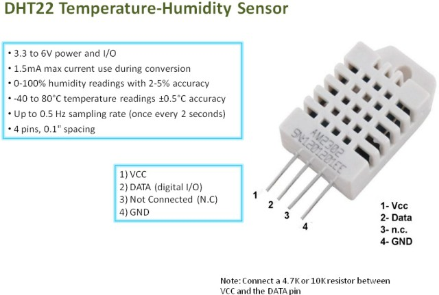

Hardware
========

PIN  | GPIO | Functions
---  | ---  | ---
LED1 | 1    | GPIO only
LED2 | 2    | GPIO only
5    | 3    | PWM
1    | 4    | PWM
9    | 5    | DHT/1-Wire
7    | 6    | RCremote
6    | 7    | GPIO only
4    | 8    | GPIO only

