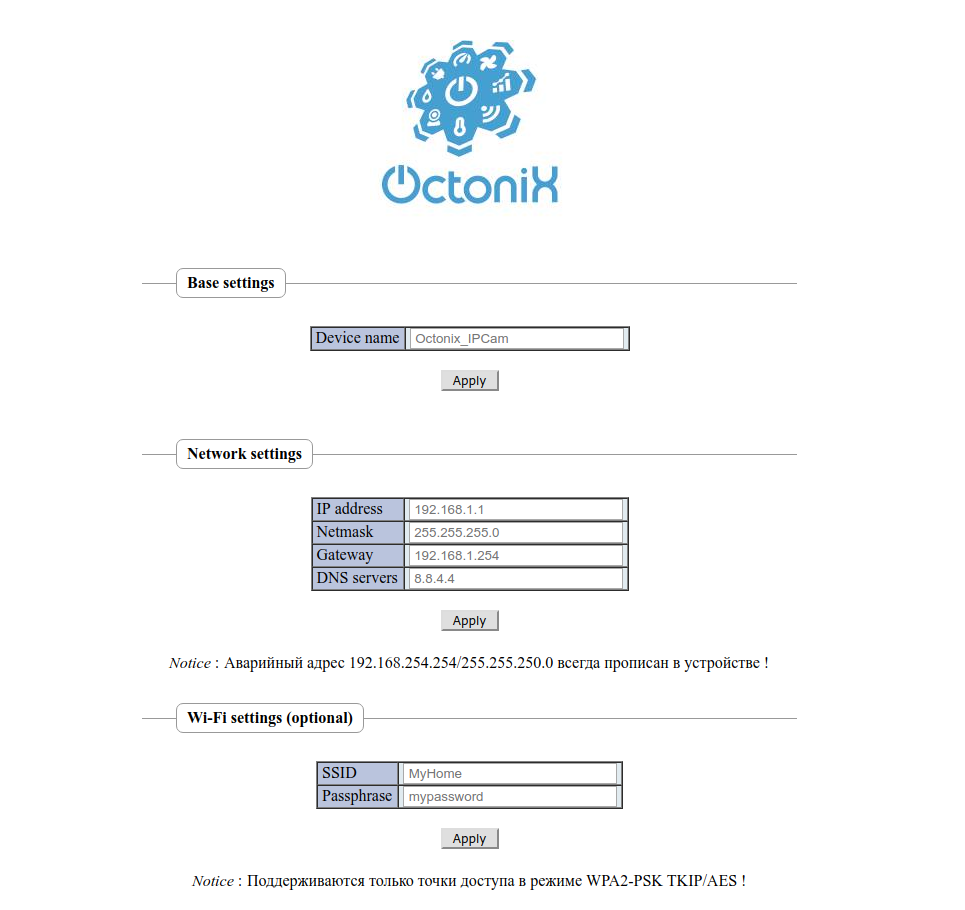
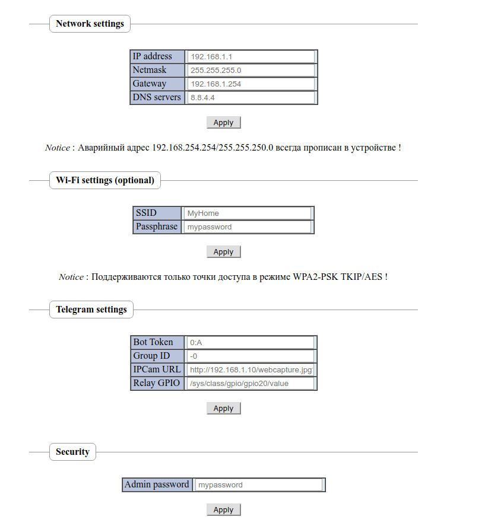

tg-web
======

TG-Web - a minimalistic web interface for bots and automation systems

License
=======

This sources is free software; you can redistribute it and/or modify it under the terms of
the GNU Lesser General Public License as published by the Free Software Foundation;
either version 2.1 of the License, or (at your option) any later version.

You should have received a copy of the GNU Lesser General Public License along with this
script; if not, please visit http://www.gnu.org/copyleft/gpl.html for more information.

Usage
=====

More info for use TG-Web on OpenWRT routers you can see [here (Russian)](http://zftlab.org)

